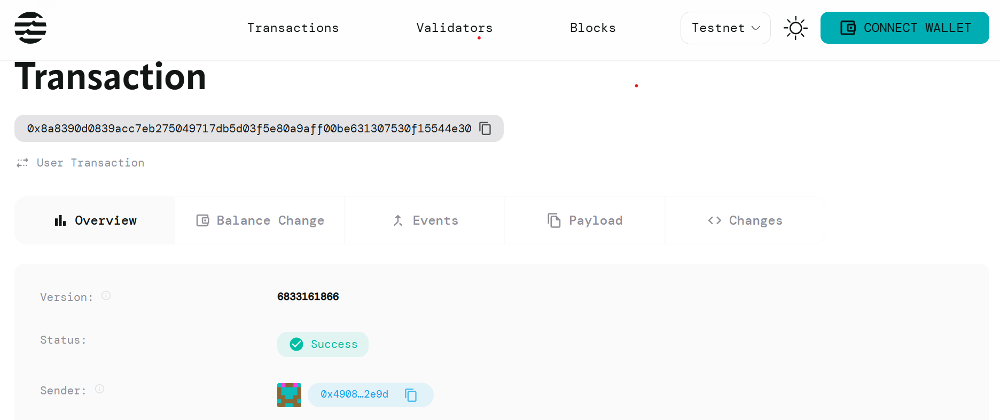

# Proof of Humanity

## Project Description

Proof of Humanity is a blockchain-based smart contract system designed to create robust human verification mechanisms that effectively prevent bot infiltration and ensure authentic user participation in decentralized applications. The system provides a tamper-proof way to verify and maintain records of human identity on the Aptos blockchain.

## Project Vision

Our vision is to establish a decentralized, trustless identity verification system that:
- Eliminates the need for centralized identity providers
- Creates a universal standard for human verification across Web3 applications
- Provides privacy-preserving identity solutions while maintaining security
- Enables fair participation in blockchain ecosystems by preventing bot manipulation
- Builds the foundation for a more equitable and authentic digital society

## Key Features

### 🔐 **Decentralized Verification**
- On-chain verification records stored directly on the Aptos blockchain
- No reliance on centralized authorities or third-party verification services
- Immutable verification history with transparent audit trails

### ⏰ **Time-Based Validity**
- Configurable verification expiry periods to maintain security
- Automatic expiration handling to prevent stale verifications
- Flexible validity periods based on verification method used

### 🛡️ **Anti-Bot Protection**
- Multiple verification methods support (biometric, social, behavioral)
- Prevents duplicate verifications for the same address
- Real-time verification status checking for instant bot detection

### 🔍 **Transparent Verification Status**
- Public verification checking without revealing personal data
- Clear verification timestamps and methods used
- Easy integration with other smart contracts and dApps

### 💡 **Developer-Friendly**
- Simple two-function API for easy integration
- Comprehensive error handling and status codes
- Lightweight contract design optimized for gas efficiency

## Future Scope

### **Phase 1: Enhanced Verification Methods**
- Integration with biometric verification systems
- Social media account linking and verification
- Behavioral analysis for bot detection
- Multi-factor verification combinations

### **Phase 2: Cross-Chain Compatibility**
- Bridge implementations for other blockchain networks
- Universal verification standards across different chains
- Interoperability protocols for seamless verification transfer

### **Phase 3: Privacy Enhancements**
- Zero-knowledge proof integration for privacy-preserving verification
- Anonymous verification options while maintaining security
- Selective disclosure mechanisms for different verification levels

### **Phase 4: Ecosystem Integration**
- DeFi protocol integrations for human-only yield farming
- NFT marketplace human verification requirements
- Governance token voting restricted to verified humans
- Social platform bot-free environments

### **Phase 5: Advanced Features**
- Reputation scoring based on verification history
- Verification marketplace for different trust levels
- AI-powered verification method recommendations
- Automated verification renewal systems

## Contract Details
0x8a8390d0839acc7eb275049717db5d03f5e80a9aff00be631307530f15544e30
